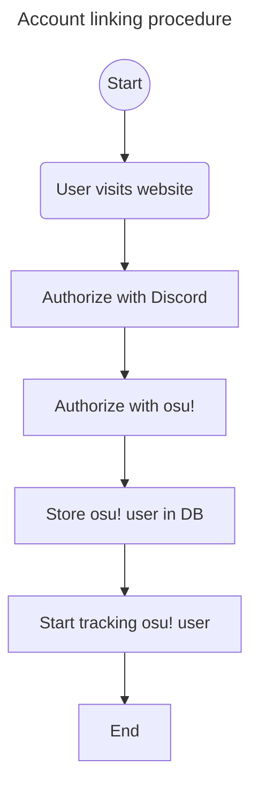

# User Verification

```mermaid
---
title: Join verification procedure
---
flowchart TD;
    subgraph Main
        startMain(("Start")) --> join("User joined")
        join --> roleExists{{"Verified role exists in guild?"}}
        roleExists -- yes --> accountLinked{{"User has linked account?"}}
            accountLinked -- no --> userMethodChoice("User made method choice")
            userMethodChoice --> methodChoice{{"CAPTCHA or osu!?"}}
                methodChoice -- osu! --> link[["Account linking procedure"]]
                    link --> endLink(["End"])
                methodChoice -- CAPTCHA --> captcha["Provide CAPTCHA"]
                captcha --> captchaResponse("User responded to CAPTCHA")
                captchaResponse --> captchaCorrect{{"CAPTCHA correct?"}}
                captchaCorrect -- no --> userMethodChoice
                captchaCorrect -- yes --> verifyInfo["[DM] Inform user about account linking"]
                verifyInfo --> assignRole["Assign verified role"]
                assignRole --> endCaptcha(["End"])
            accountLinked -- yes --> assignRole
        roleExists -- no --> endNoRole(["End"])
    end
    subgraph Kick Timer
        startTimer(("Start")) --> wait["Wait for 1 hour"]
        wait --> getUsers["Get users without verified role<br>who joined 1+ hour ago"]
        getUsers --> kick["Kick users"]
        kick --> wait
    end
```

```mermaid
---
title: Account linking procedure
---
flowchart TD;
    s(("Start")) --> web("User visits website")
    web --> authDiscord["Authorize with Discord"]
    authDiscord --> authOsu["Authorize with osu!"]
    authOsu --> storeDb["Store osu! user in DB"]
    storeDb --> track["Start tracking osu! user"]
    track --> end1["End"]
```
