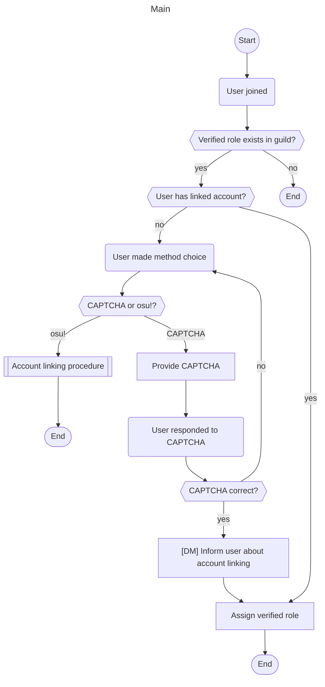
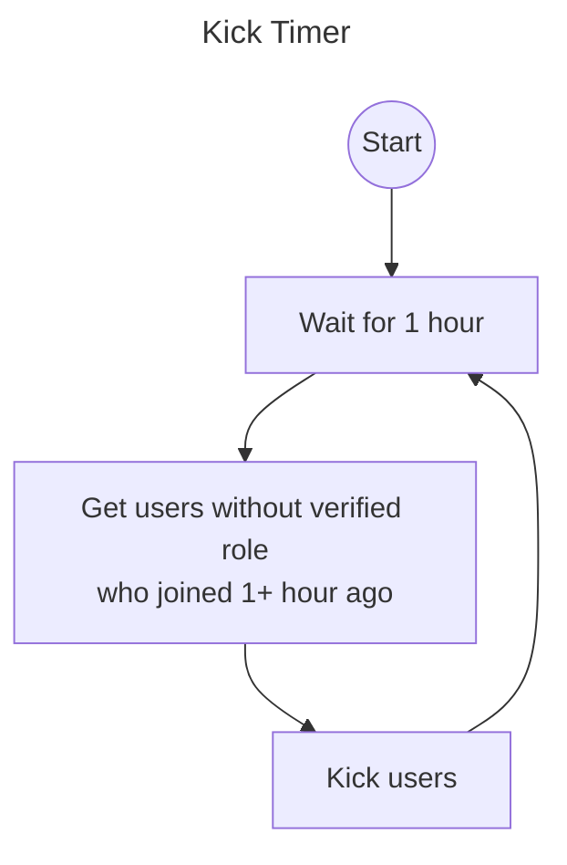
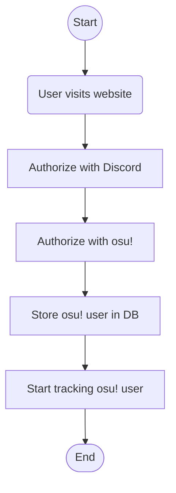

## Join Verification Procedure

```mermaid
---
title: Main
---
flowchart TD;
    startMain(("Start")) --> join("User joined")
    join --> roleExists{{"Verified role exists in guild?"}}
    roleExists -- yes --> accountLinked{{"User has linked account?"}}
        accountLinked -- no --> userMethodChoice("User made method choice")
        userMethodChoice --> methodChoice{{"CAPTCHA or osu!?"}}
            methodChoice -- osu! --> link[["Account linking procedure"]]
                link --> endLink(["End"])
            methodChoice -- CAPTCHA --> captcha["Provide CAPTCHA"]
            captcha --> captchaResponse("User responded to CAPTCHA")
            captchaResponse --> captchaCorrect{{"CAPTCHA correct?"}}
            captchaCorrect -- no --> userMethodChoice
            captchaCorrect -- yes --> verifyInfo["[DM] Inform user about account linking"]
            verifyInfo --> assignRole["Assign verified role"]
            assignRole --> endCaptcha(["End"])
        accountLinked -- yes --> assignRole
    roleExists -- no --> endNoRole(["End"])
```

```mermaid
---
title: Kick Timer
---
flowchart TD;
    startTimer(("Start")) --> wait["Wait for 1 hour"]
    wait --> getUsers["Get users without verified role<br>who joined 1+ hour ago"]
    getUsers --> kick["Kick users"]
    kick --> wait
```

## Account Linking Procedure

```mermaid
flowchart TD;
    s(("Start")) --> web("User visits website")
    web --> authDiscord["Authorize with Discord"]
    authDiscord --> authOsu["Authorize with osu!"]
    authOsu --> storeDb["Store osu! user in DB"]
    storeDb --> track["Start tracking osu! user"]
    track --> end1(["End"])
```
